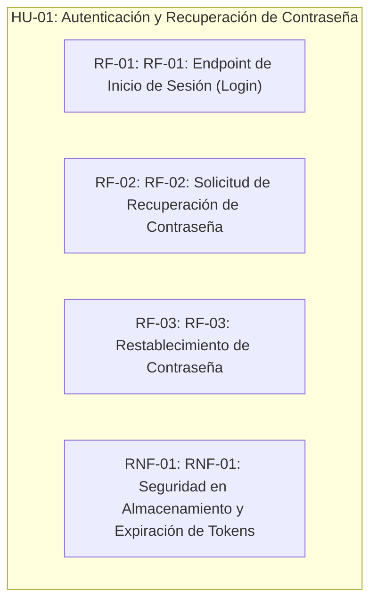

# Grafo de Dependencias -- Dashboard

_Generado automaticamente el 2026-08-21T15:05:26.622Z -- no editar a mano, se sobreescribe en cada publicacion._

```mermaid
graph TD
  subgraph US_1787324135669["HU-01: Autenticación y Recuperación de Contraseña"]
    REQ_1787324723268["RF-01: RF-01: Endpoint de Inicio de Sesión (Login)"]
    REQ_1787324723387["RF-02: RF-02: Solicitud de Recuperación de Contraseña"]
    REQ_1787324723485["RF-03: RF-03: Restablecimiento de Contraseña"]
    REQ_1787324723566["RNF-01: RNF-01: Seguridad en Almacenamiento y Expiración de Tokens"]
  end
```