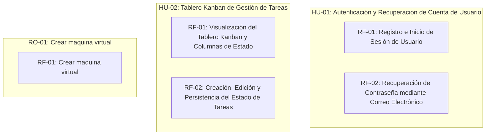

# Grafo de Dependencias -- Dashboard

_Generado automaticamente el 2026-09-04T13:02:16.711Z -- no editar a mano, se sobreescribe en cada publicacion._

```mermaid
graph TD
  subgraph US_1788520746036["HU-01: Autenticación y Recuperación de Cuenta de Usuario"]
    REQ_1788521426728["RF-01: Registro e Inicio de Sesión de Usuario"]
    REQ_1788521431531["RF-02: Recuperación de Contraseña mediante Correo Electrónico"]
  end
  subgraph US_1788520756161["HU-02: Tablero Kanban de Gestión de Tareas"]
    REQ_1788521453775["RF-01: Visualización del Tablero Kanban y Columnas de Estado"]
    REQ_1788521465401["RF-02: Creación, Edición y Persistencia del Estado de Tareas"]
  end
  subgraph US_1788524188069["RO-01: Crear maquina virtual"]
    REQ_1788524188077["RF-01: Crear maquina virtual"]
  end
```