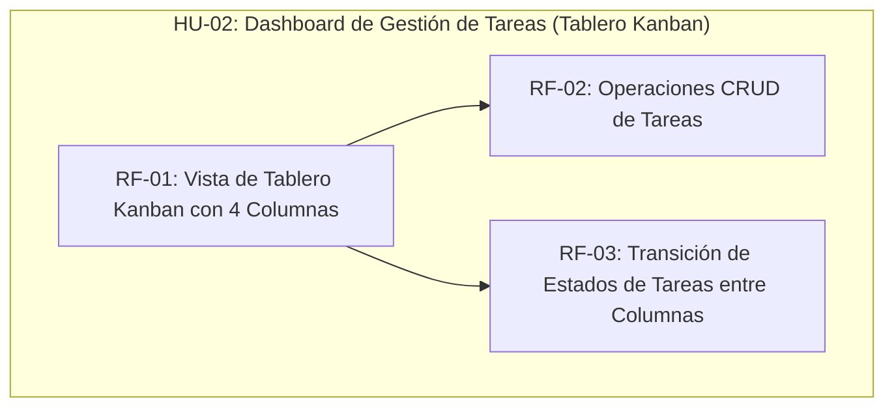

# Grafo de Dependencias -- Dashboard

_Generado automaticamente el 2026-09-04T11:03:41.410Z -- no editar a mano, se sobreescribe en cada publicacion._

```mermaid
graph TD
  subgraph US_1787932965769["HU-02: Dashboard de Gestión de Tareas (Tablero Kanban)"]
    REQ_1787933534944["RF-01: Vista de Tablero Kanban con 4 Columnas"]
    REQ_1787933540896["RF-02: Operaciones CRUD de Tareas"]
    REQ_1787933550211["RF-03: Transición de Estados de Tareas entre Columnas"]
  end
  REQ_1787933534944 --> REQ_1787933540896
  REQ_1787933534944 --> REQ_1787933550211
```